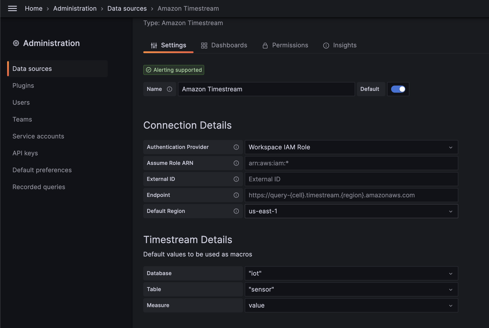
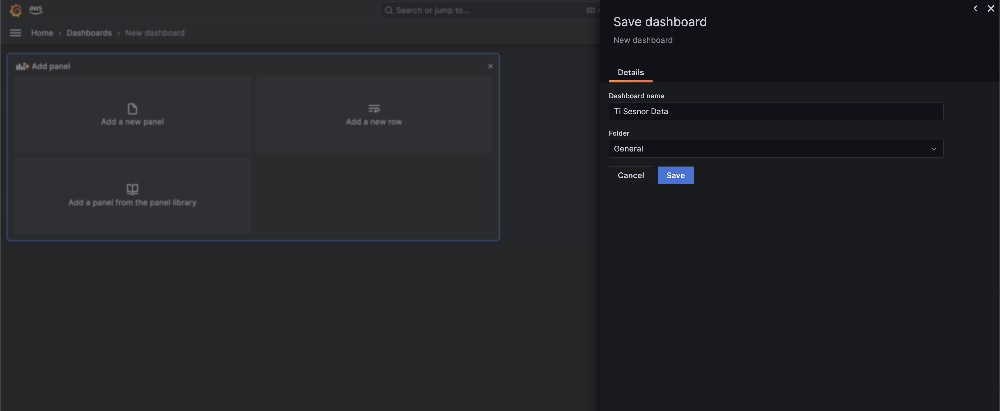
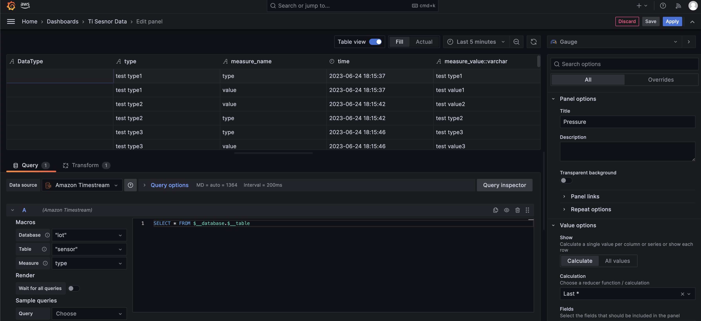
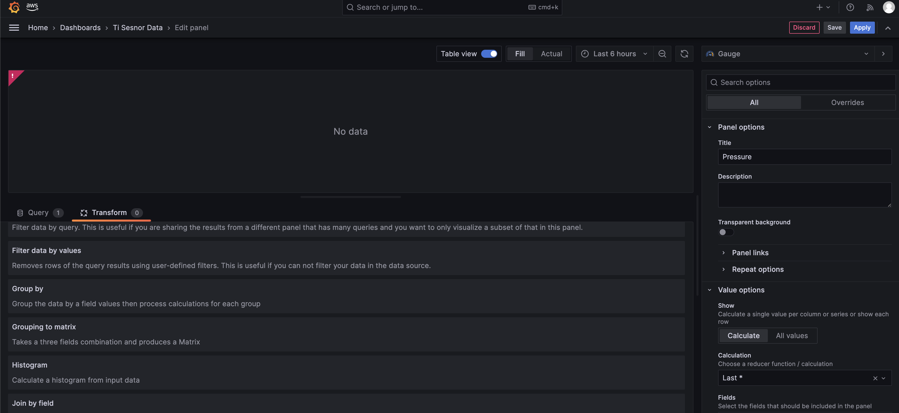
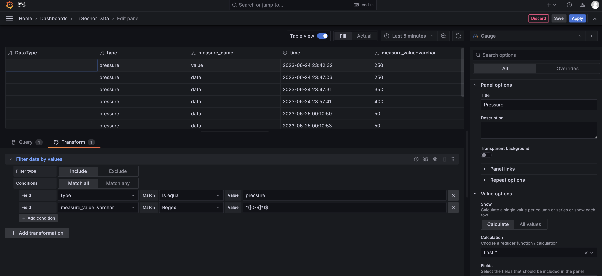
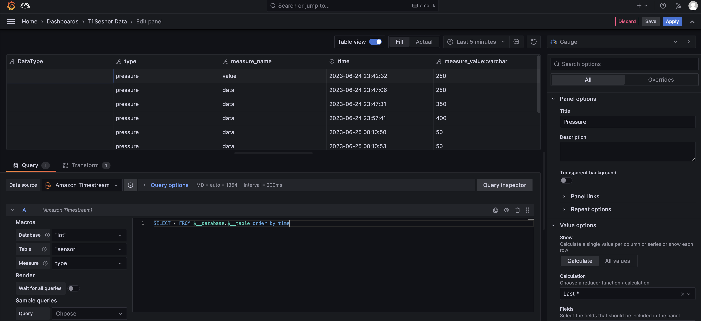
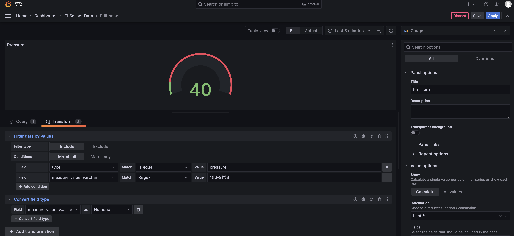
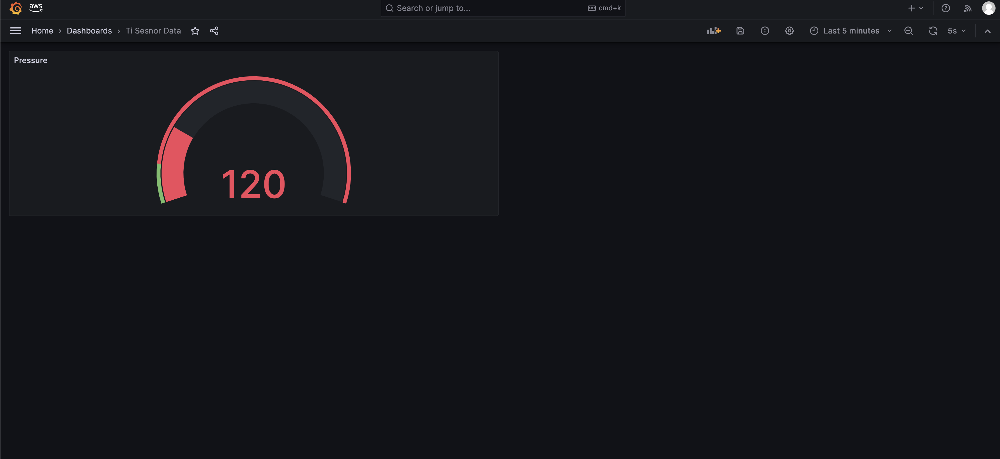

### 1. Setup Datasource
1. Go to `Administration` -> `Data Sources` -> `Add data source`

2. Select `Amazon Timestream` from given list

3. Settings
   

4. Click on `Save & Test`

### 2. Creat New Dashboard
1. Click on `New Dahsboard` icon

2. Click on `Save`
   

3. Add Panel to the Dashboard

### 3. Crate Gauge
1. Click on `Add a new panel`

2. Select `Gauge` (from Right Top Corner)

3. Enable `Table View` and Check table data
   

4. Apply `Transformation` -> `Filter data by values`
   

   

5. Change the query to `Order By Time`
   

6. If accidentally send `String` type data then we can convert data into `Numeric`
   

7. Click on `Apply`

8. Set `Refresh to every 5s`
   

### 3. Create Time Series
