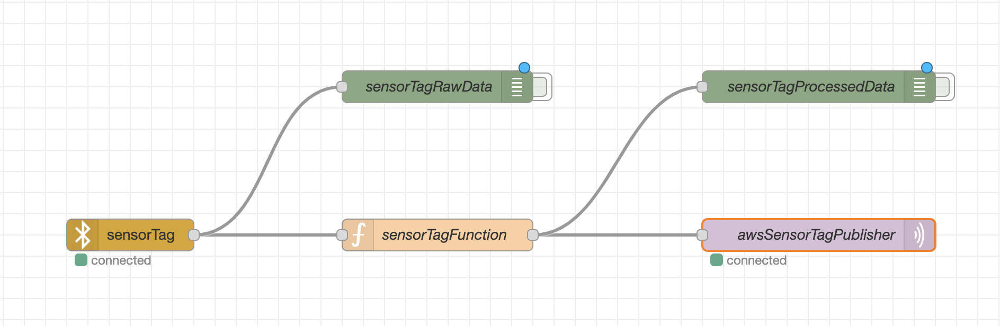
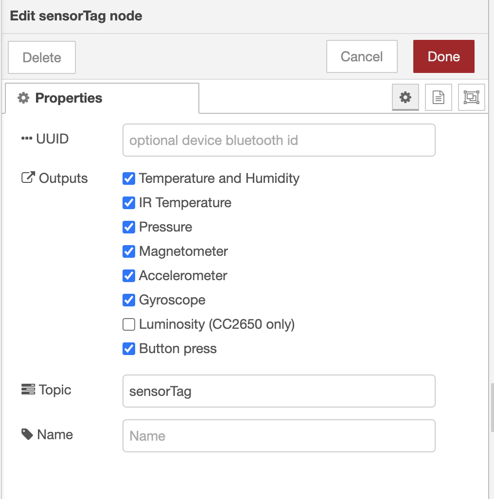
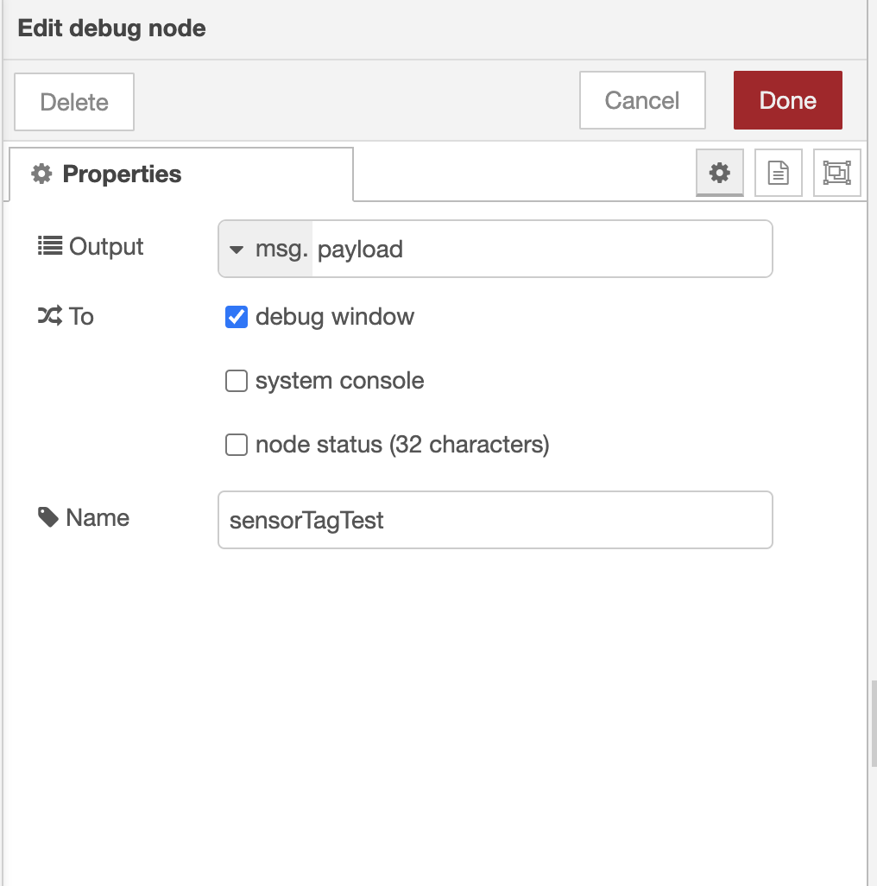
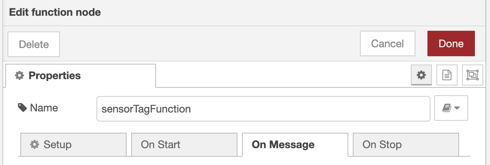
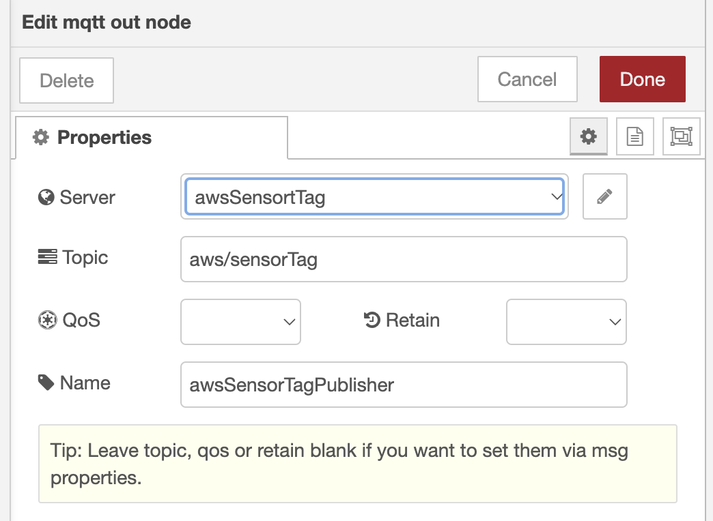
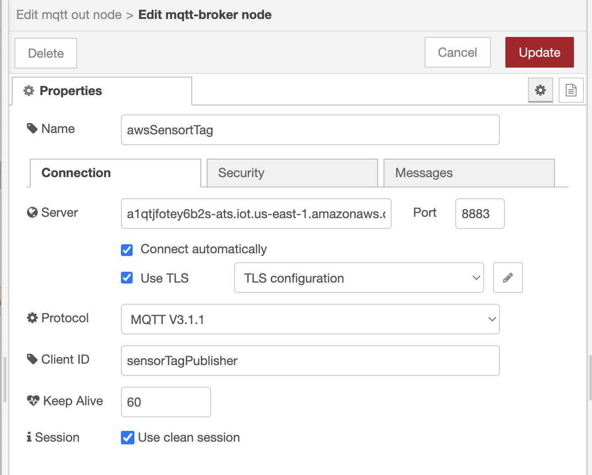
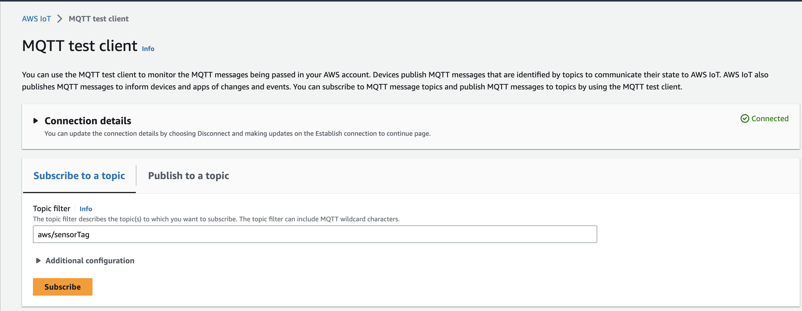
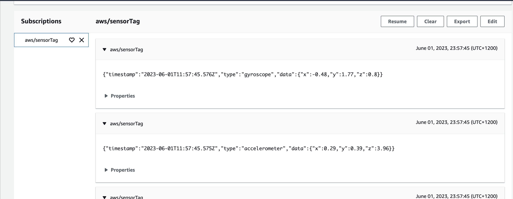

## Configure the IOT Flow on Node-Red 

### Component Diagram



### Configure `sensorTag` Node



### Configure `debug` Node



### Configure `function` Node


```js
if (msg.topic === "sensorTag/pressure") {
    return { 
        payload: {
            timestamp: new Date(),
            type: "pressure",
            data: msg.payload
        }
    };
} else if (msg.topic === "sensorTag/accelerometer"){
    return {
        payload: {
            timestamp: new Date(),
            type: "accelerometer",
            data: msg.payload
        }
    };
} else if (msg.topic === "sensorTag/gyroscope") {
    return {
        payload: {
            timestamp: new Date(),
            type: "gyroscope",
            data: msg.payload
        }
    };
} else if (msg.topic === "sensorTag/magnetometer") {
    return {
        payload: {
            timestamp: new Date(),
            type: "magnetometer",
            data: msg.payload
        }
    };
} else if (msg.topic === "fsensorTag/humidity") {
    return {
        payload: {
            timestamp: new Date(),
            type: "humidity",
            data: msg.payload
        }
    };
};
```

### Configure `mqttOut` Node
- Configure `Add new mqtt-broker`



- Configure `AWS IOT Core` details



- Configure `Certificates` (Generated via Terraform)


### **DEPLOY** and **TEST** 
- Click on **Deploy** Button
<br><br>

- `TEST`: Enable ***Debug* Node and check on **Debug Console**
  <br><br>

- `AWS TEST`
  1. Click on **MQTT test client**
  2. **Subscribe** to the **MQTT TOPIC**
  
    

   

    


